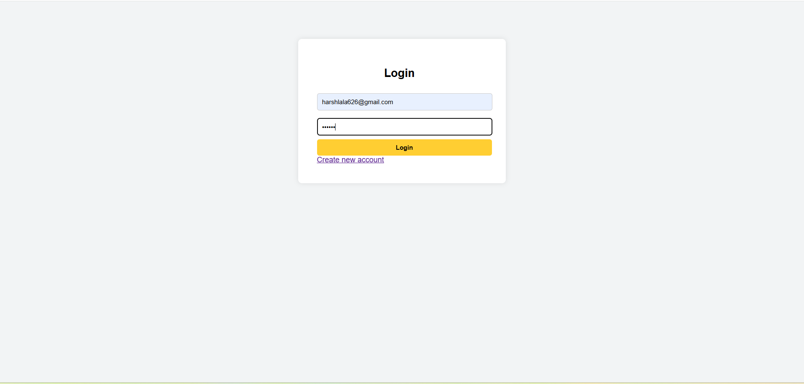
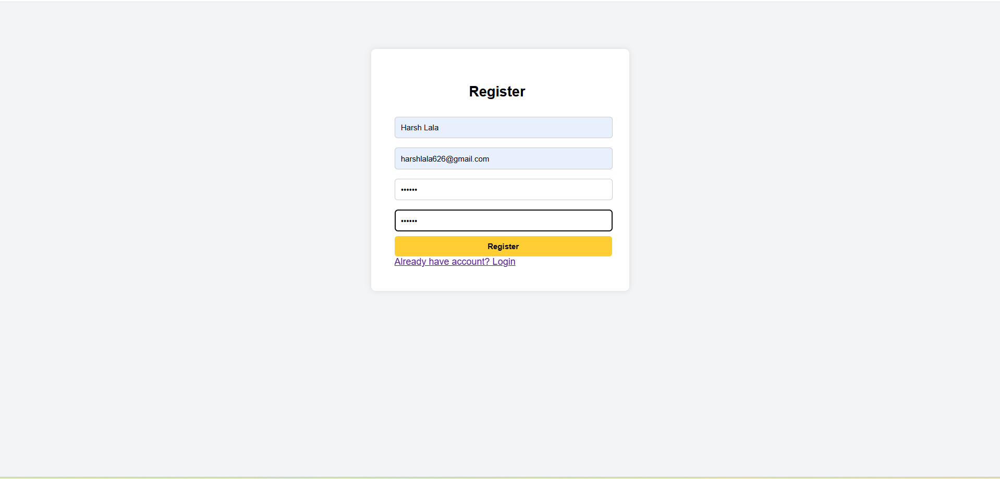
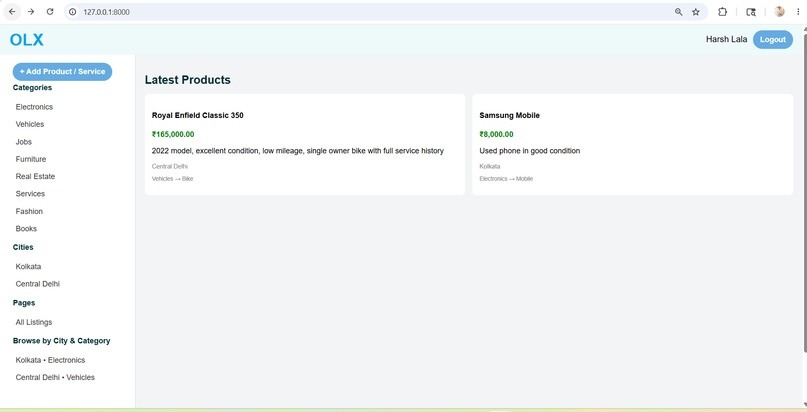
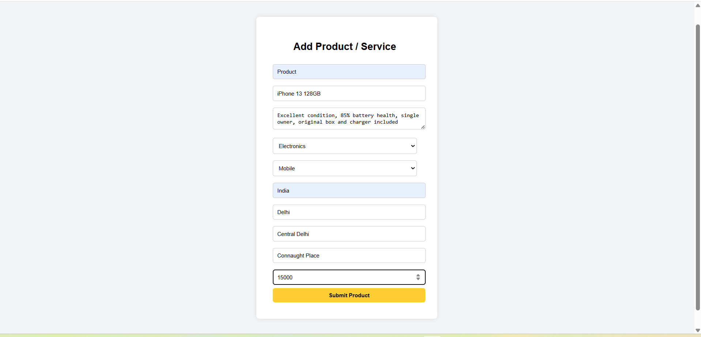

<<<<<<< HEAD
#  OLX Marketplace Clone (Laravel)

A simple OLX-like marketplace web application built with Laravel where users can post products/services and browse listings by category and city.

---

##  Features

 User Registration & Login
 Add Product / Service
 Category & Subcategory system
 City-based filtering
 Browse listings
 User authentication (Auth middleware)
 Product listing with price, location, details

---

##  Tech Stack

- Laravel 12
- PHP 8.2
- MySQL
- HTML, CSS
- Blade Templates

---

##  Screenshots

### Login Page


### Register Page


###  Home Page


###  Add Product Page


---

## ⚙️ Installation

```bash
git clone https://github.com/yourusername/olx-marketplace.git
cd olx-marketplace
composer install
cp .env.example .env
php artisan key:generate
php artisan migrate
php artisan serve
=======
# OLX-Laravel
OLX  website built with Laravel. Users can register, add products/services, browse category-wise listings, and view city-wise products.
>>>>>>> a91412af7aaaa1888c276381fbff39a5f5204809
